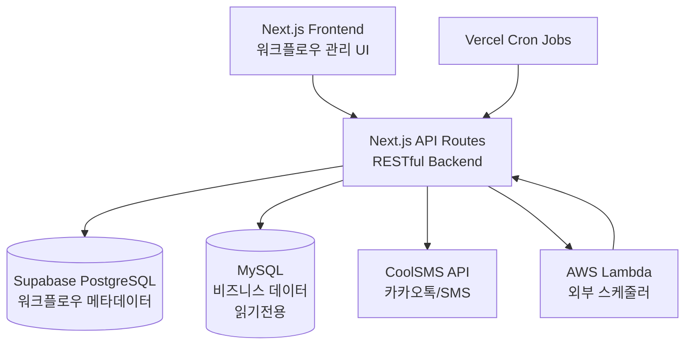
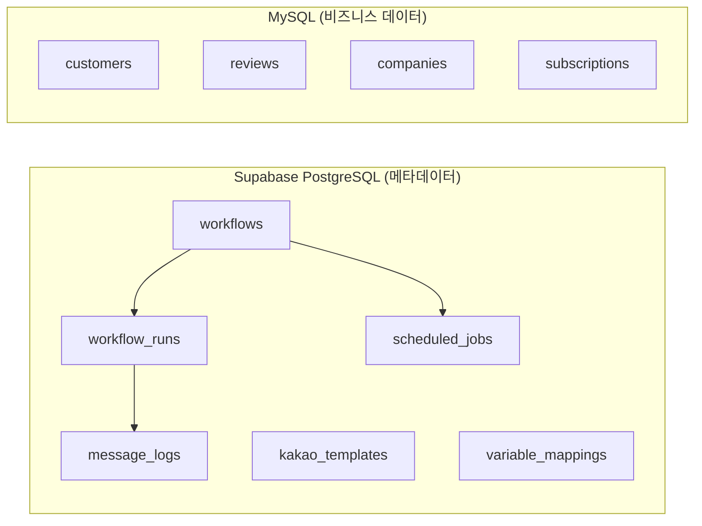
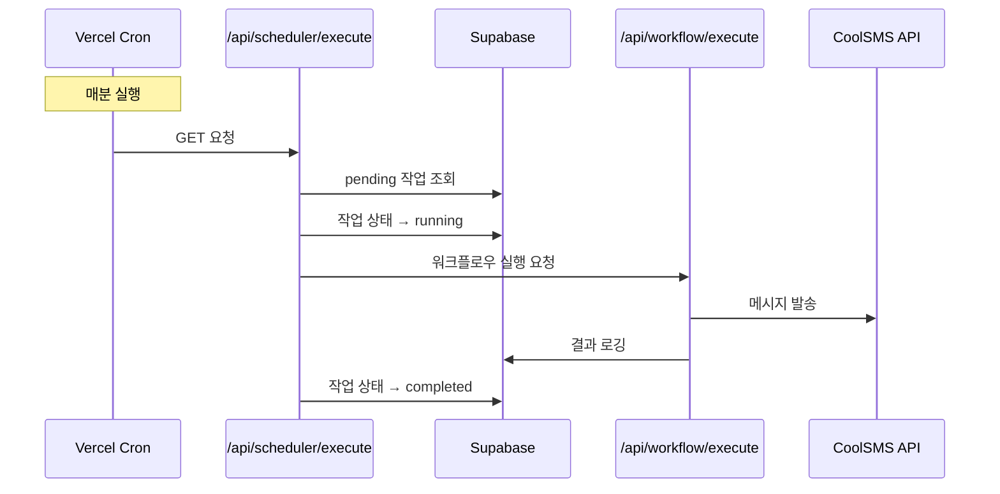
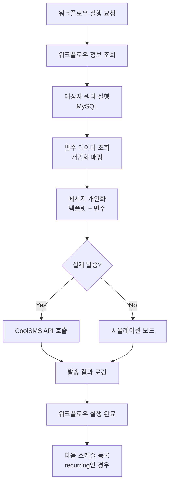
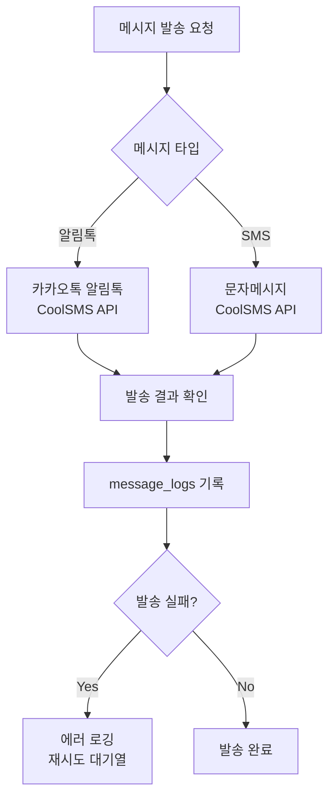

# CRM 시스템 백엔드 아키텍처 완벽 가이드

> **작성일**: 2024년 12월  
> **목적**: 백엔드 아키텍처 전체 이해 및 API 최적화를 위한 기반 지식  
> **대상**: 개발자, 아키텍트

## 📋 목차
1. [시스템 개요](#1-시스템-개요)
2. [데이터베이스 아키텍처](#2-데이터베이스-아키텍처)
3. [API 엔드포인트 체계](#3-api-엔드포인트-체계)
4. [스케줄러 시스템](#4-스케줄러-시스템)
5. [워크플로우 실행 흐름](#5-워크플로우-실행-흐름)
6. [메시지 발송 시스템](#6-메시지-발송-시스템)
7. [외부 서비스 연동](#7-외부-서비스-연동)

---

## 1. 시스템 개요

### 1.1 전체 아키텍처


### 1.2 핵심 구성요소
- **프론트엔드**: Next.js 15 (App Router)
- **백엔드**: Next.js API Routes (Node.js)
- **메타데이터 DB**: Supabase PostgreSQL
- **비즈니스 DB**: MySQL (기존 운영 DB, 읽기전용)
- **메시징**: CoolSMS API (카카오톡 알림톡, SMS)
- **스케줄링**: Vercel Cron + AWS Lambda
- **배포**: Vercel

### 1.3 3단계 워크플로우 시스템
이 시스템의 핵심은 **3단계 워크플로우**입니다:

1. **대상 선정** (`target_config`)
   - MySQL 동적 쿼리로 메시지 수신자 추출
   - 예: "최근 30일 리뷰 없는 고객"

2. **메시지 템플릿 선택** (`message_config`)
   - 카카오톡 알림톡 템플릿 선택
   - 템플릿 변수 설정

3. **변수 매핑** (`mapping_config`)
   - 대상자 데이터와 템플릿 변수 연결
   - 개인화된 메시지 생성

---

## 2. 데이터베이스 아키텍처

### 2.1 하이브리드 DB 구조


### 2.2 핵심 테이블 구조

#### 📋 workflows (워크플로우 메인)
```sql
CREATE TABLE workflows (
  id UUID PRIMARY KEY,
  name VARCHAR(255) NOT NULL,
  status VARCHAR(50) DEFAULT 'draft', -- draft, active, paused, archived
  trigger_type VARCHAR(100), -- manual, schedule, webhook
  
  -- 3단계 워크플로우 데이터
  target_config JSONB DEFAULT '{}',   -- 대상 선정 (MySQL 쿼리)
  message_config JSONB DEFAULT '{}',  -- 메시지 템플릿 설정  
  mapping_config JSONB DEFAULT '{}',  -- 변수 매핑 설정
  
  -- 스케줄 및 실행 설정
  schedule_config JSONB DEFAULT '{}', -- 스케줄 설정
  trigger_config JSONB DEFAULT '{}',  -- 트리거 설정
  
  -- 메타데이터
  statistics JSONB DEFAULT '{}',
  last_run_at TIMESTAMP WITH TIME ZONE,
  next_run_at TIMESTAMP WITH TIME ZONE,
  created_at TIMESTAMP WITH TIME ZONE DEFAULT NOW()
);
```

**주요 JSON 구조:**
```typescript
// target_config - 대상 선정
{
  "targetGroups": [
    {
      "id": "group_1",
      "name": "최근 30일 리뷰 없는 고객", 
      "type": "dynamic",
      "dynamicQuery": {
        "sql": "SELECT id, phone, company_name FROM customers WHERE last_review_date < DATE_SUB(NOW(), INTERVAL 30 DAY)"
      }
    }
  ]
}

// message_config - 메시지 템플릿
{
  "templates": [
    {
      "templateCode": "TK_REVIEW_REQUEST",
      "templateName": "리뷰 요청",
      "variables": {
        "company_name": {"sourceType": "target", "field": "company_name"},
        "review_count": {"sourceType": "query", "sql": "SELECT COUNT(*) FROM reviews WHERE company_id = ?"}
      }
    }
  ]
}

// schedule_config - 스케줄 설정
{
  "type": "recurring",           // immediate, delay, scheduled, recurring
  "timezone": "Asia/Seoul",
  "recurringPattern": {
    "frequency": "daily",        // daily, weekly, monthly
    "time": "09:00",
    "interval": 1
  }
}
```

#### ⏰ scheduled_jobs (스케줄 작업)
```sql
CREATE TABLE scheduled_jobs (
  id UUID PRIMARY KEY,
  workflow_id UUID REFERENCES workflows(id),
  job_type VARCHAR(50) NOT NULL,     -- workflow_execution, template_sync
  status VARCHAR(50) DEFAULT 'pending', -- pending, running, completed, failed
  scheduled_time TIMESTAMP WITH TIME ZONE NOT NULL,
  executed_at TIMESTAMP WITH TIME ZONE,
  workflow_data JSONB,              -- 실행 시 필요한 데이터 (웹훅 데이터 등)
  result JSONB,
  error_message TEXT,
  created_at TIMESTAMP WITH TIME ZONE DEFAULT NOW()
);
```

#### 📱 message_logs (메시지 발송 로그)  
```sql
CREATE TABLE message_logs (
  id UUID PRIMARY KEY,
  workflow_run_id UUID REFERENCES workflow_runs(id),
  recipient_phone VARCHAR(20),
  recipient_name VARCHAR(255), 
  message_type VARCHAR(50),         -- sms, kakao
  message_content TEXT,
  status VARCHAR(50),               -- pending, sent, delivered, failed
  provider_message_id VARCHAR(255), -- CoolSMS 메시지 ID
  cost DECIMAL(8,2) DEFAULT 0,
  sent_at TIMESTAMP WITH TIME ZONE,
  error_message TEXT
);
```

### 2.3 MySQL 비즈니스 데이터 (읽기전용)
```sql
-- 고객 정보
customers (
  id, phone, company_name, email, 
  created_at, last_review_date
)

-- 리뷰 데이터  
reviews (
  id, company_id, rating, content,
  created_at, status
)

-- 구독 정보
subscriptions (
  id, customer_id, plan, status,
  start_date, end_date
)
```

---

## 3. API 엔드포인트 체계

### 3.1 전체 API 구조 (66개 엔드포인트)

#### 🔄 워크플로우 관리
```
POST   /api/workflows          # 워크플로우 생성
GET    /api/workflows          # 워크플로우 목록
PUT    /api/workflows/[id]     # 워크플로우 수정
DELETE /api/workflows/[id]     # 워크플로우 삭제

POST   /api/workflow/execute   # 워크플로우 실행 (핵심)
POST   /api/workflow/preview   # 미리보기
POST   /api/workflow/test      # 테스트 실행
```

#### ⏰ 스케줄러 시스템
```
GET    /api/scheduler/execute  # 스케줄 작업 실행 (Vercel Cron)
GET    /api/scheduler/monitor  # 스케줄러 모니터링
GET    /api/scheduler/health   # 헬스체크
POST   /api/scheduler/cron     # 스케줄 등록/갱신

GET    /api/scheduler/logs     # 실행 로그
GET    /api/scheduler/execution-logs # 상세 실행 로그
```

#### 🗃️ 데이터베이스 연동
```
POST   /api/mysql/query        # MySQL 쿼리 실행
GET    /api/mysql/companies    # 회사 목록
GET    /api/mysql/statistics   # 통계 데이터
GET    /api/mysql/schema       # 스키마 정보

GET    /api/supabase/workflows # Supabase 워크플로우 조회
POST   /api/supabase/migrate   # 데이터 마이그레이션
```

#### 📨 메시지 발송
```
POST   /api/sms/send           # SMS 발송
POST   /api/send-message       # 통합 메시지 발송

GET    /api/templates/[id]     # 템플릿 상세
GET    /api/templates/coolsms/list # CoolSMS 템플릿 목록
POST   /api/templates/sync     # 템플릿 동기화
```

#### 🪝 웹훅 시스템
```
POST   /api/webhook/lead_created # 리드 생성 웹훅 (핵심)
POST   /api/webhook/[eventType]  # 일반 웹훅
```

#### 🧪 테스트 및 개발
```
GET    /api/test-env           # 환경 테스트
POST   /api/test-mapping       # 매핑 테스트
GET    /api/test-supabase      # Supabase 연결 테스트
```

### 3.2 핵심 API 상세

#### POST `/api/workflow/execute` (워크플로우 실행)
**요청:**
```typescript
{
  workflowId: string,
  scheduledExecution?: boolean,  // 스케줄된 실행인지
  jobId?: string,               // 스케줄 작업 ID
  enableRealSending?: boolean   // 실제 메시지 발송 여부
}
```

**처리 과정:**
1. 워크플로우 정보 조회 (`workflows` 테이블)
2. 대상자 쿼리 실행 (`target_config` → MySQL)
3. 변수 데이터 조회 및 매핑 (`mapping_config`)
4. 개인화된 메시지 생성
5. CoolSMS API 호출 (실제 발송 시)
6. 결과 로깅 (`message_logs`, `workflow_runs`)

#### POST `/api/webhook/lead_created` (리드 생성 웹훅)
**요청:**
```json
{
  "phone": "010-1234-5678",     // 필수
  "company": "테스트 회사",      // 권장  
  "email": "test@example.com"   // 선택
}
```

**처리 과정:**
1. 웹훅 데이터 검증
2. 해당 이벤트를 트리거로 하는 워크플로우 조회
3. 스케줄 작업 생성 (`scheduled_jobs`)
4. 즉시 실행 또는 예약 실행

---

## 4. 스케줄러 시스템

### 4.1 스케줄러 아키텍처


### 4.2 스케줄 작업 생성 과정

#### 1단계: 워크플로우 활성화 시
```typescript
// schedule_config에 따라 다음 실행 시간 계산
if (schedule_config.type === 'recurring') {
  const nextTime = calculateNextKoreaScheduleTime(
    schedule_config.recurringPattern.time,
    schedule_config.recurringPattern.frequency,
    schedule_config.timezone
  );
  
  // scheduled_jobs에 작업 등록
  await supabase
    .from('scheduled_jobs')
    .insert({
      workflow_id: workflow.id,
      job_type: 'workflow_execution',
      status: 'pending',
      scheduled_time: nextTime,
      workflow_data: {}
    });
}
```

#### 2단계: Vercel Cron 실행 (매분)
```typescript
// /api/scheduler/execute
export async function GET() {
  // 1. 실행 시간이 된 pending 작업들 조회
  const { data: jobs } = await supabase
    .from('scheduled_jobs')
    .select('*')
    .eq('status', 'pending')
    .lte('scheduled_time', new Date().toISOString());
  
  // 2. 각 작업을 running 상태로 변경 (중복 실행 방지)
  // 3. 워크플로우 실행 API 호출
  // 4. 다음 스케줄 작업 등록 (recurring인 경우)
}
```

### 4.3 실행 모니터링

#### GET `/api/scheduler/monitor` (실시간 상태)
```json
{
  "statistics": {
    "total": 58,
    "pending": 1,    // 대기 중
    "running": 0,    // 실행 중  
    "completed": 45, // 완료
    "failed": 12     // 실패
  },
  "upcoming_jobs": [...],     // 예정 작업
  "recent_completed": [...]   // 최근 완료 작업
}
```

#### GET `/api/scheduler/health` (시스템 상태)
```json
{
  "cron_status": {
    "is_healthy": true,
    "last_execution": "2024-12-01T10:00:00Z",
    "minutes_since_last": 5
  },
  "lambda_status": {
    "is_working": true,
    "pending_overdue_count": 0
  }
}
```

---

## 5. 워크플로우 실행 흐름

### 5.1 완전한 실행 과정


### 5.2 단계별 상세

#### 1단계: 대상자 조회
```typescript
// target_config에서 SQL 추출
const targetQuery = workflow.target_config.targetGroups[0].dynamicQuery.sql;

// MySQL 실행
const targets = await executeQuery(targetQuery);
// 결과: [{ id: 1, phone: "010-1234-5678", company_name: "회사A" }, ...]
```

#### 2단계: 변수 데이터 조회
```typescript
// message_config에서 변수 쿼리들 추출
const variables = workflow.message_config.templates[0].variables;

for (const [varName, varConfig] of Object.entries(variables)) {
  if (varConfig.sourceType === 'query') {
    // 각 대상자에 대해 변수 쿼리 실행
    const variableData = await executeQuery(varConfig.sql, [target.id]);
    target[varName] = variableData[0]?.value || varConfig.defaultValue;
  }
}
```

#### 3단계: 메시지 개인화
```typescript
// 템플릿 내용
const template = "안녕하세요 {{company_name}}님! 현재 리뷰가 {{review_count}}개 있습니다.";

// 변수 치환
const personalizedMessage = template
  .replace('{{company_name}}', target.company_name)
  .replace('{{review_count}}', target.review_count);
```

#### 4단계: 메시지 발송
```typescript
// CoolSMS API 호출
const result = await fetch('https://api.coolsms.co.kr/messages/v4/send', {
  method: 'POST',
  headers: { 'Authorization': `Bearer ${token}` },
  body: JSON.stringify({
    message: {
      to: target.phone,
      from: SMS_CONFIG.from,
      text: personalizedMessage,
      type: 'ATA',  // 알림톡
      kakaoOptions: {
        pfId: KAKAO_CONFIG.pfId,
        templateId: template.templateCode
      }
    }
  })
});
```

---

## 6. 메시지 발송 시스템

### 6.1 발송 체계


### 6.2 CoolSMS 연동

#### 인증 설정
```typescript
const COOLSMS_CONFIG = {
  apiKey: process.env.COOLSMS_API_KEY,
  apiSecret: process.env.COOLSMS_API_SECRET,
  fromNumber: process.env.COOLSMS_FROM_NUMBER
};

const KAKAO_CONFIG = {
  pfId: process.env.COOLSMS_KAKAO_PF_ID,
  senderKey: process.env.COOLSMS_KAKAO_SENDER_KEY
};
```

#### 발송 API 호출
```typescript
// 알림톡 발송
const response = await fetch('https://api.coolsms.co.kr/messages/v4/send', {
  method: 'POST',
  headers: {
    'Authorization': `Bearer ${accessToken}`,
    'Content-Type': 'application/json'
  },
  body: JSON.stringify({
    message: {
      to: recipient.phone,
      from: COOLSMS_CONFIG.fromNumber,
      text: personalizedMessage,
      type: 'ATA',
      kakaoOptions: {
        pfId: KAKAO_CONFIG.pfId,
        templateId: templateCode,
        variables: templateVariables
      }
    }
  })
});
```

### 6.3 발송 결과 처리
```typescript
// 성공 시
await supabase
  .from('message_logs')
  .insert({
    workflow_run_id: runId,
    recipient_phone: target.phone,
    recipient_name: target.company_name,
    message_type: 'kakao',
    message_content: personalizedMessage,
    status: 'sent',
    provider: 'coolsms',
    provider_message_id: result.groupId,
    cost: result.price,
    sent_at: new Date().toISOString()
  });

// 실패 시  
await supabase
  .from('message_logs')
  .insert({
    // ... 기본 정보
    status: 'failed',
    error_code: result.errorCode,
    error_message: result.errorMessage,
    failed_at: new Date().toISOString()
  });
```

---

## 7. 외부 서비스 연동

### 7.1 AWS Lambda 스케줄러 (선택적)
Vercel Cron의 보완재로 AWS Lambda를 사용할 수 있습니다:

```javascript
// aws-lambda/cron-scheduler.js
exports.handler = async (event) => {
  // Vercel API 호출
  const response = await fetch('https://your-domain.vercel.app/api/scheduler/execute', {
    method: 'GET',
    headers: {
      'x-cron-secret': process.env.CRON_SECRET_TOKEN
    }
  });
  
  return {
    statusCode: 200,
    body: JSON.stringify({ success: true })
  };
};
```

### 7.2 웹훅 시스템
외부 시스템에서 이벤트 발생 시 워크플로우 자동 실행:

```typescript
// 리드 생성 웹훅
POST /api/webhook/lead_created
{
  "phone": "010-1234-5678",
  "company": "신규 고객사",
  "email": "contact@newcustomer.com",
  "source": "웹사이트 문의"
}

// 처리 과정:
// 1. 웹훅 데이터 검증
// 2. lead_created 트리거 워크플로우 조회  
// 3. 즉시 실행 또는 스케줄 등록
// 4. 웹훅 데이터를 개인화 변수로 활용
```

---

## 🎯 API 최적화를 위한 인사이트

### 현재 아키텍처의 강점
1. **명확한 책임 분리**: 메타데이터(Supabase) vs 비즈니스 데이터(MySQL)
2. **유연한 쿼리 시스템**: 동적 SQL로 다양한 대상자 선정 가능
3. **안정적인 스케줄링**: DB 기반 큐 + Vercel Cron 조합
4. **실시간 모니터링**: 상세한 실행 로그 및 상태 추적

### 최적화 기회
1. **API 응답 구조 표준화**: 현재 각 API마다 다른 응답 구조
2. **에러 핸들링 통일**: 일관된 에러 코드 및 메시지 체계
3. **캐싱 전략**: 자주 조회되는 템플릿/쿼리 결과 캐싱
4. **배치 처리**: 대량 메시지 발송 시 배치 단위 처리
5. **API 버전 관리**: 하위 호환성을 위한 버전 체계

### 권장 개선 사항
1. **OpenAPI 스펙 활용**: 현재 구축된 Swagger 기반 개발 가이드
2. **응답 포맷 통일**: 성공/실패 응답 구조 표준화
3. **페이지네이션**: 목록 API에 일관된 페이징 적용
4. **필터링 강화**: 쿼리 파라미터 기반 세밀한 필터링
5. **성능 최적화**: 데이터베이스 쿼리 및 API 응답 시간 개선

이 가이드를 바탕으로 API 명세서를 더욱 효율적으로 개선할 수 있을 것입니다! 🚀
